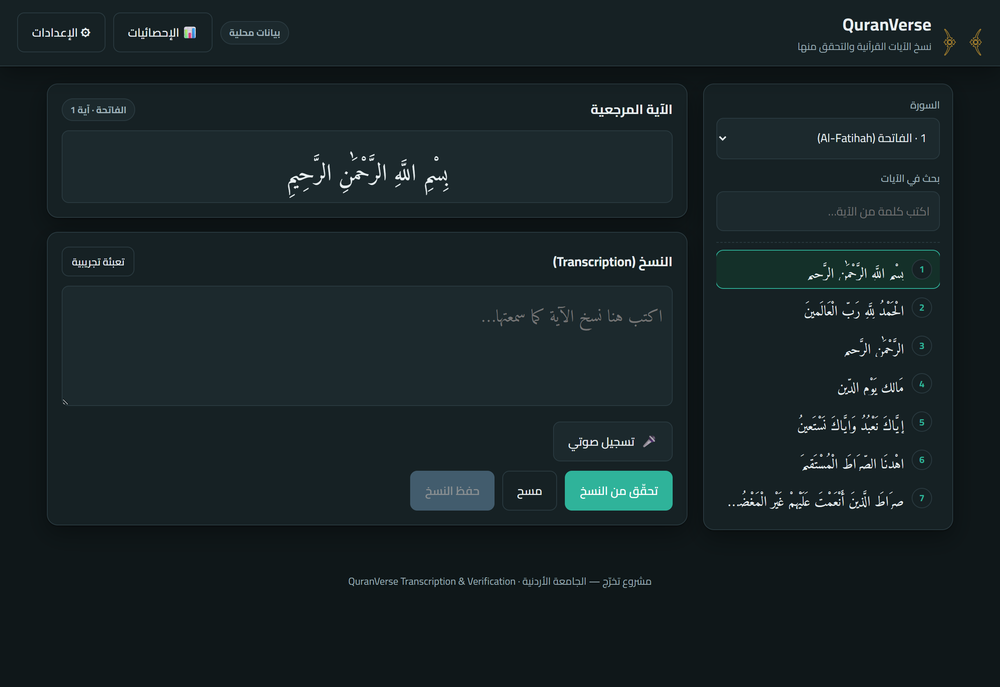
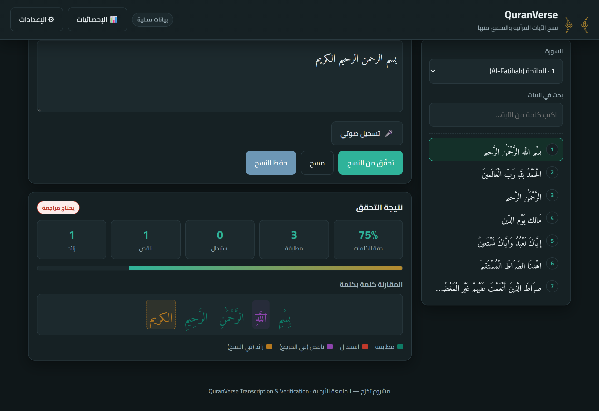
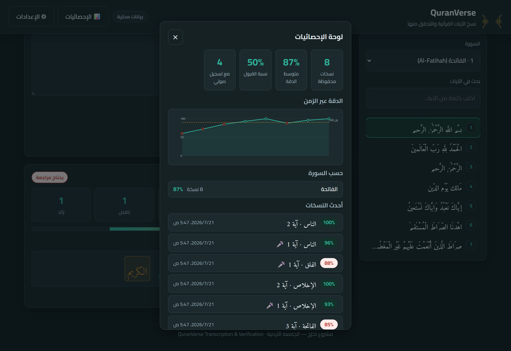

<h1 align="center">🕌 QuranVerse — Transcription &amp; Verification</h1>

<p align="center">
  A front-end web app for <b>transcribing and verifying Quranic verses</b> with accurate right-to-left Arabic rendering.<br/>
  <i>Graduation Project — University of Jordan</i>
</p>

<p align="center">
  <a href="https://saeedramadancv-sys.github.io/quranverse/"></a>
</p>

<p align="center">
  
  
  
  
  
</p>

Users pick a surah/ayah, type (or **dictate**) a transcription of the verse, and
the app scores it against the reference text word-by-word — highlighting matches,
substitutions, missing and extra words — with fully accurate right-to-left Arabic
rendering.

---

## 📸 Screenshots

<p align="center">
  
  <br/><em>Browse surahs and ayahs with a Quran-grade Arabic typeface</em>
</p>

<p align="center">
  
  <br/><em>Word-by-word verification: accuracy score and colour-coded diff (match / substitution / missing / extra)</em>
</p>

<p align="center">
  
  <br/><em>Statistics dashboard: accuracy-over-time chart, per-surah breakdown, and CSV/JSON export</em>
</p>

---

## Features

- **Right-to-left Arabic rendering** using a Quran-grade typeface (Amiri Quran).
- **Speech-to-text dictation** (Web Speech API, `ar-SA`) — dictate a verse and
  it streams into the transcription field, appending to existing text.
- **Audio recording with WAV export** — captures the mic during dictation and
  produces a downloadable 16-bit PCM WAV, with inline playback.
- **Word-by-word verification** with a diacritic-insensitive Arabic matcher
  (Levenshtein alignment → match / substitution / deletion / insertion).
- **Accuracy scoring** (Word Accuracy %) with a configurable pass threshold.
- **Statistics dashboard** — local history of saved transcriptions with total
  count, average accuracy, pass rate, audio count, a per-surah breakdown, an
  **accuracy-over-time line chart** (inline SVG, no libraries), and **CSV / JSON
  export** of the full history.
- **REST API integration** with a partner backend, plus a graceful **offline
  fallback** to local sample data and a local verification engine.
- **Clean, responsive layout** (desktop → mobile) with light/dark support.
- **Live search** across the ayahs of the selected surah.
- **Settings panel** to point the app at any backend URL and test the connection.

---

## Project structure

```
app/
├── www/                     # The web app (single source; served & bundled into Android)
│   ├── index.html           # Markup & layout (dir="rtl", lang="ar")
│   ├── css/styles.css       # RTL-first responsive styling, light/dark
│   └── js/
│       ├── config.js        # Backend URL & runtime config (localStorage-backed)
│       ├── data.js          # Offline sample Quran data (fallback)
│       ├── verify.js        # Arabic-aware verification engine (Levenshtein)
│       ├── api.js           # REST layer + graceful fallback
│       ├── speech.js        # Speech-to-text (Web Speech API + native Android plugin)
│       ├── recorder.js      # Mic capture + WAV (16-bit PCM) export
│       ├── stats.js         # Local history & statistics (localStorage)
│       └── app.js           # UI controller
├── android/                 # Capacitor Android project (build the APK here)
├── server.js                # Zero-dep static server (serves www/)
├── start.bat                # Double-click → run server + open browser
├── sync-app.bat             # Double-click → npx cap sync android
├── capacitor.config.json    # Capacitor config (appId, webDir=www)
└── BUILD_ANDROID.md         # Full APK build guide
```

## Android app (Capacitor)

The web app is wrapped as a native Android app with **Capacitor**. Everything is
scaffolded — building the final `.apk` requires **Android Studio** (SDK + a
bundled JDK). See **[BUILD_ANDROID.md](BUILD_ANDROID.md)** for step-by-step
instructions. On device, speech-to-text uses the native
`@capacitor-community/speech-recognition` plugin (Android WebView lacks the Web
Speech API), and the backend URL should point at the partner server's LAN IP
rather than `localhost`.

## Browser support for voice features

Speech-to-text uses the Web Speech API (**Chrome / Edge / Safari**; not
Firefox) and requires a secure context (`https://` or `localhost`). Audio
recording uses `MediaRecorder` + the Web Audio API for WAV encoding. When a
feature is unavailable the app degrades gracefully — manual typing always works
and a clear message is shown. Both need microphone permission.

---

## Running locally

Because the app loads JS modules and fonts, serve it over HTTP (opening the
file directly via `file://` disables some browser features). Easiest on Windows:
**double-click `start.bat`** — it launches the bundled server and opens the
browser. Or manually:

```bash
node server.js       # serves www/ on http://localhost:8123/
```

Then open <saeedramadancv-sys.github.io/quranverse/> in Chrome or Edge.

---

## Connecting the partner's backend

Open **⚙ الإعدادات** (Settings), set the API base URL, enable
"استخدام الباك-إند", and press **اختبار الاتصال** to verify connectivity.
Settings persist in `localStorage`.

Expected REST contract (adjust `js/api.js` to match the backend):

| Method | Endpoint                     | Purpose                              |
|--------|------------------------------|--------------------------------------|
| GET    | `/surahs`                    | List surahs                          |
| GET    | `/surahs/{n}/ayahs`          | List ayahs of a surah                |
| POST   | `/verify`                    | Verify a transcription (server-side) |
| POST   | `/transcriptions`            | Store a verified transcription       |

`POST /verify` body:

```json
{ "surah": 1, "ayah": 1, "reference": "…", "transcription": "…" }
```

If the backend omits `accuracy`/`ops`, the app computes them locally, so
integration can proceed incrementally.

---

## Verification method

Text is normalized (diacritics and tatweel removed, alef/ya/ta-marbuta
variants unified) so a bare transcription matches a diacritized reference.
A word-level Levenshtein alignment then classifies every token and reports:

```
Word Accuracy = matches / referenceWords × 100
```

Defaults to a 90% pass threshold (configurable in `js/config.js`).

---

_Built with HTML, CSS, and vanilla JavaScript — no build step required._
